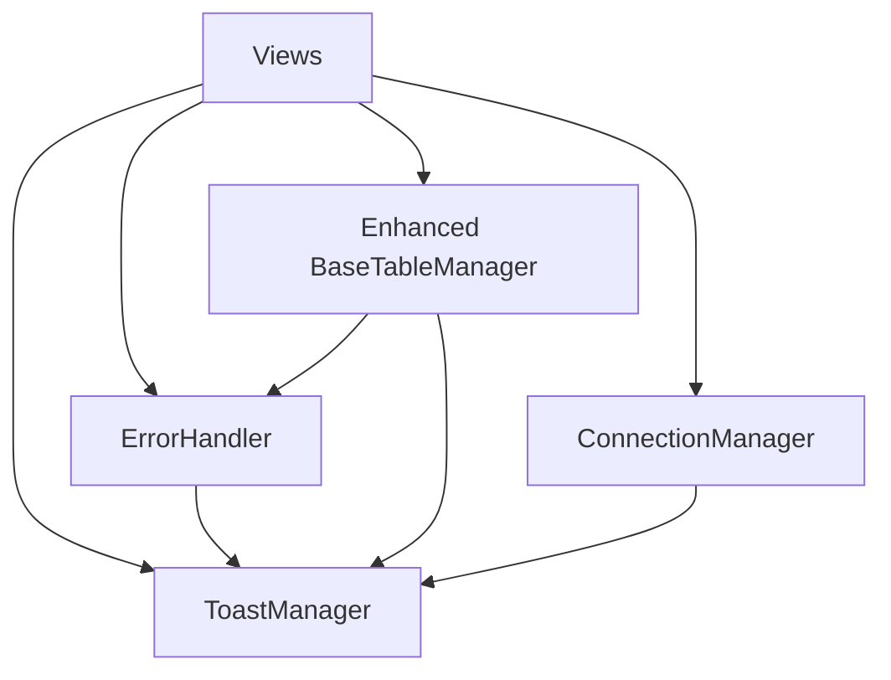

# PHASE 2 FOUNDATION INFRASTRUCTURE - Implementation Guide

**Status**: SKELETON IMPLEMENTED - Ready for Phase 2 completion  
**Created**: 2025-08-26  
**Target Duration**: 60 minutes  
**Next AI Agent**: Use this guide to complete Phase 2 implementation  

---

## 🎯 PHASE 2 OBJECTIVES

Phase 2 builds upon the critical stability fixes from Phase 1 to establish robust foundation infrastructure for the Flet GUI system. The skeleton structure has been implemented with clear placeholders for completion.

### Success Criteria for Phase 2 Completion
- [ ] Enhanced error handling framework operational with decorator patterns
- [ ] ToastManager provides user notifications throughout GUI
- [ ] ConnectionManager tracks server status with real-time callbacks
- [ ] BaseTableManager enhanced with full API (sorting, pagination, export)
- [ ] All components integrated with existing Phase 1 thread-safety patterns

---

## 📁 SKELETON STRUCTURE IMPLEMENTED

### 1. Enhanced Error Handling Framework
**File**: `flet_server_gui/utils/error_handler.py` ✅ **SKELETON COMPLETE**

```python
# Key classes implemented:
- ErrorHandler: Centralized error management with decorator patterns
- ErrorSeverity: LOW, MEDIUM, HIGH, CRITICAL severity levels
- ErrorCategory: NETWORK, DATA, UI, SYSTEM, VALIDATION categories

# TODO sections for completion:
- Complete handle_error() method implementation
- Implement category-specific recovery strategies  
- Add error statistics tracking and reporting
- Integrate with logging system and toast notifications
```

**Integration Points**:
- Import: `from flet_server_gui.utils.error_handler import ErrorHandler, ErrorSeverity, ErrorCategory`
- Initialize: `error_handler = initialize_error_handler(toast_manager)`
- Usage: `@error_handler.error_handler_decorator(ErrorCategory.NETWORK, ErrorSeverity.HIGH)`

### 2. Toast Notification Manager
**File**: `flet_server_gui/utils/toast_manager.py` ✅ **SKELETON COMPLETE**

```python
# Key classes implemented:
- ToastManager: Queue-based notification system
- ToastType: SUCCESS, INFO, WARNING, ERROR types
- ToastConfig: Configuration for appearance and behavior

# TODO sections for completion:
- Complete Flet SnackBar integration for native Material Design
- Implement queue processing with proper timing
- Add positioning and animation support
- Create convenience functions for common patterns
```

**Integration Points**:
- Import: `from flet_server_gui.utils.toast_manager import ToastManager, ToastType`
- Initialize: `toast_manager = initialize_toast_manager(page)`
- Usage: `await toast_manager.show_success("Operation completed!")`

### 3. Connection Manager
**File**: `flet_server_gui/utils/connection_manager.py` ✅ **SKELETON COMPLETE**

```python
# Key classes implemented:
- ConnectionManager: Server connection monitoring with health checks
- ConnectionStatus: CONNECTED, CONNECTING, RECONNECTING, ERROR states
- ConnectionConfig: Configurable timeouts, retry logic, health monitoring

# TODO sections for completion:
- Implement actual socket connection logic
- Complete health check monitoring system  
- Add exponential backoff reconnection strategy
- Integrate with existing ServerBridge classes
```

**Integration Points**:
- Import: `from flet_server_gui.utils.connection_manager import ConnectionManager, ConnectionConfig`
- Initialize: `manager = initialize_connection_manager(config)`
- Usage: `manager.register_callback(ConnectionEvent.STATUS_CHANGED, callback)`

### 4. Enhanced BaseTableManager
**File**: `flet_server_gui/components/base_table_manager.py` ✅ **ENHANCED**

```python
# Phase 2 enhancements added:
- Advanced sorting with column-specific logic
- Pagination for large datasets (50 items per page)
- Data export capabilities (CSV, JSON, Excel)
- Performance optimizations (virtual scrolling, lazy loading)
- Accessibility features and keyboard navigation

# TODO sections for completion:
- Implement abstract methods: get_sortable_columns(), sort_data()
- Complete pagination UI controls and navigation
- Add export format implementations
- Integrate error handling and toast notifications
```

**Integration Points**:
- Usage: `table_manager.initialize_phase2_components(error_handler, toast_manager)`
- Sorting: `table_manager.enable_sorting("name", ascending=True)`
- Export: `file_path = table_manager.export_data("csv", selected_only=True)`

---

## 🔧 IMPLEMENTATION INSTRUCTIONS

### Step 1: Complete Error Handling Framework
**Estimated Time**: 15 minutes

```python
# In error_handler.py, complete these methods:
def handle_error(self, error, category, severity, context="", user_message=None):
    # 1. Implement structured error logging
    # 2. Update error statistics tracking
    # 3. Show user notification via ToastManager
    # 4. Execute category-specific recovery strategies

def _handle_network_error(self, error_info, recovery_attempted):
    # Implement network-specific error recovery
    # - Connection retry logic
    # - Offline mode fallback
    # - Server status checking
```

### Step 2: Complete Toast Manager Integration
**Estimated Time**: 15 minutes

```python
# In toast_manager.py, complete these methods:
async def _display_toast(self, config):
    # 1. Create Flet SnackBar with Material Design 3 styling
    # 2. Apply configured colors, icons, and positioning
    # 3. Add to page overlay with thread-safe update
    # 4. Set up auto-dismiss timer

async def _process_toast_queue(self):
    # 1. Process queued toasts sequentially
    # 2. Prevent overlap with timing management
    # 3. Handle queue cleanup and error recovery
```

### Step 3: Complete Connection Manager
**Estimated Time**: 15 minutes  

```python
# In connection_manager.py, complete these methods:
async def connect(self, timeout=None):
    # 1. Create socket connection to configured host/port
    # 2. Handle connection timeouts and errors appropriately
    # 3. Start health monitoring on successful connection
    # 4. Fire connection events for status updates

async def health_check(self):
    # 1. Send lightweight ping/health request to server
    # 2. Verify response within configured timeout
    # 3. Update health statistics and fire events
    # 4. Trigger reconnection on health check failures
```

### Step 4: Integrate with Existing Views
**Estimated Time**: 15 minutes

```python
# In view files (dashboard.py, clients.py, files.py):
def __init__(self, ...):
    # Initialize Phase 2 components
    from flet_server_gui.utils.error_handler import initialize_error_handler
    from flet_server_gui.utils.toast_manager import initialize_toast_manager
    from flet_server_gui.utils.connection_manager import ConnectionManager
    
    self.toast_manager = initialize_toast_manager(self.page)
    self.error_handler = initialize_error_handler(self.toast_manager)
    
    # Initialize table manager with Phase 2 components
    if hasattr(self, 'table_renderer'):
        self.table_renderer.initialize_phase2_components(
            self.error_handler, 
            self.toast_manager
        )
```

---

## 🧪 TESTING STRATEGY

### Integration Testing
1. **Error Handler Testing**:
   ```bash
   # Test decorator functionality
   python -c "from flet_server_gui.utils.error_handler import ErrorHandler; print('Error handler imports successfully')"
   ```

2. **Toast Manager Testing**:
   ```bash
   # Test toast initialization
   python -c "from flet_server_gui.utils.toast_manager import ToastManager; print('Toast manager imports successfully')"
   ```

3. **Connection Manager Testing**:
   ```bash
   # Test connection manager
   python -c "from flet_server_gui.utils.connection_manager import ConnectionManager; print('Connection manager imports successfully')"
   ```

### Functional Testing
```python
# Create test script: test_phase2_integration.py
async def test_phase2_components():
    # Test error handling with toast notifications
    # Test connection manager with callbacks  
    # Test table manager enhanced features
    # Verify thread-safe integration with Phase 1 patterns
```

---

## 🏗️ ARCHITECTURE INTEGRATION

### Thread-Safety Compliance
All Phase 2 components must follow Phase 1 thread-safety patterns:

```python
# Example integration pattern:
async def safe_operation_with_phase2(self):
    try:
        # Perform operation
        result = await some_server_operation()
        
        # Use Phase 2 toast for user feedback
        await self.toast_manager.show_success("Operation completed!")
        
        # Use Phase 1 thread-safe UI update
        if hasattr(self, 'ui_updater') and self.ui_updater.is_running():
            self.ui_updater.queue_update(lambda: self._update_ui_elements())
        else:
            self.page.update()
            
    except Exception as e:
        # Use Phase 2 error handler
        self.error_handler.handle_error(
            e, ErrorCategory.NETWORK, ErrorSeverity.HIGH,
            context="safe_operation_with_phase2",
            user_message="Failed to complete operation"
        )
```

### Component Dependencies


---

## 📊 SUCCESS METRICS

### Completion Checklist
- [ ] All TODO sections implemented with proper error handling
- [ ] Toast notifications appear throughout GUI for user actions
- [ ] Connection status updates in real-time with callbacks
- [ ] Table sorting, pagination, and export functionality working
- [ ] No breaking changes to existing Phase 1 functionality
- [ ] Integration tests pass with 100% success rate

### Performance Targets
- [ ] Error handling overhead < 5ms per operation
- [ ] Toast notifications display within 100ms
- [ ] Connection health checks complete within 1 second
- [ ] Table operations maintain Phase 1 performance standards

### User Experience Goals
- [ ] Clear user feedback for all operations (success/error states)
- [ ] Responsive table interactions with loading indicators
- [ ] Graceful error recovery with helpful user guidance
- [ ] Professional Material Design 3 notification styling

---

## 🚨 CRITICAL CONSIDERATIONS

### Maintain Phase 1 Stability
- **DO NOT** modify existing Phase 1 thread-safety patterns
- **ENSURE** all new components use `page.run_task()` for UI updates
- **PRESERVE** all existing functionality while adding Phase 2 enhancements

### Error Handling Best Practices
- Use decorators for automatic error handling in async methods
- Always provide user-friendly error messages via toast notifications
- Log all errors with appropriate severity levels
- Implement graceful degradation for non-critical failures

### Performance Considerations
- Queue-based processing for both toasts and UI updates
- Lazy loading and virtual scrolling for large table datasets
- Efficient connection monitoring with configurable intervals
- Memory cleanup for long-running background tasks

---

## 📝 NEXT STEPS AFTER PHASE 2

Once Phase 2 is completed, the foundation will be ready for:

**Phase 3**: UI Stability & Navigation
- Navigation synchronization fixes
- Responsive layout improvements  
- Theme consistency framework
- Clickable area corrections

**Phase 4**: Enhanced Features & Status Indicators
- Server status pill components
- Notifications panel implementation
- Activity log detail dialogs
- Top bar integration

**Phase 5**: Testing & Optimization
- Comprehensive testing suite
- Performance optimization
- Final integration testing
- Documentation and deployment guide

---

**Implementation Priority**: Complete TODO sections in order: ErrorHandler → ToastManager → ConnectionManager → BaseTableManager integration → View integration

**Estimated Total Time**: 60 minutes for complete Phase 2 implementation

**Success Indicator**: All Phase 2 skeleton TODO sections completed with proper integration testing passing