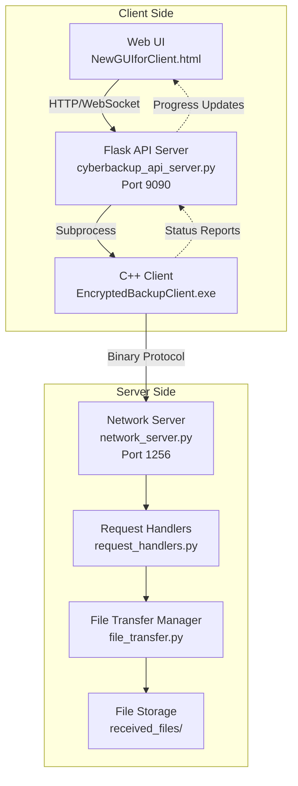
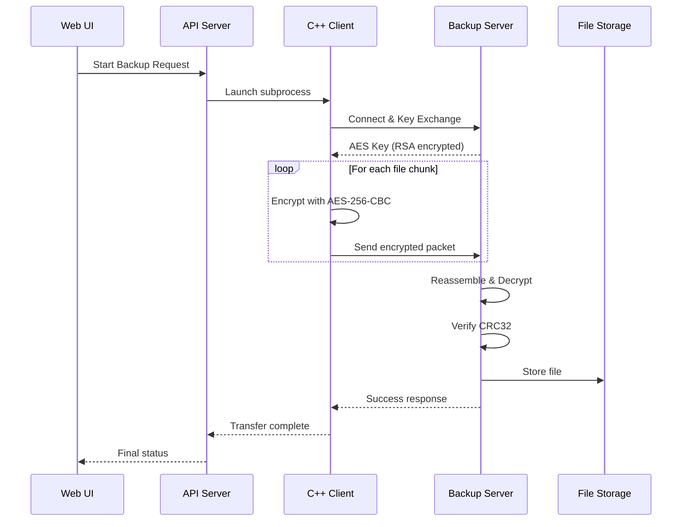
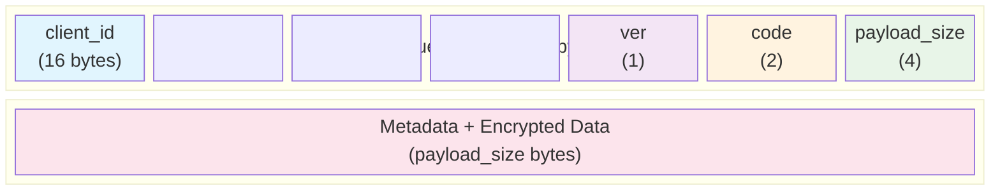
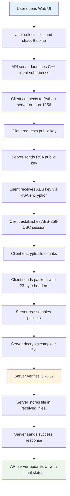
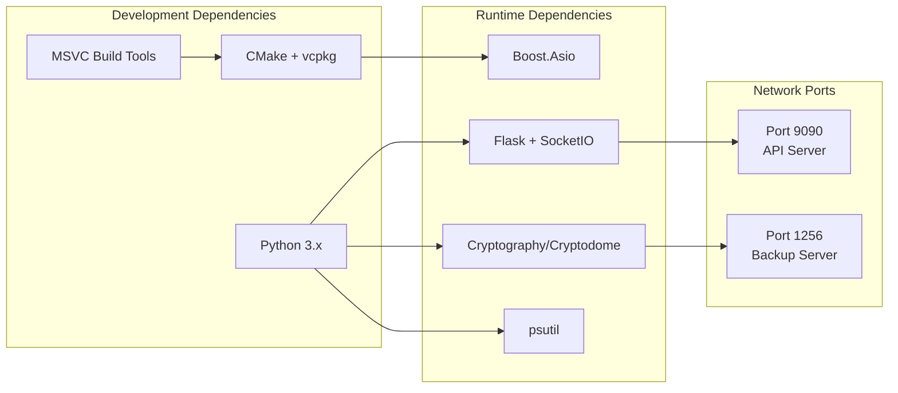

# CyberBackup 3.0 – Project Overview and Engineer Onboarding

## Executive Summary
CyberBackup 3.0 is a secure, client–server, encrypted file backup system. A browser-based UI drives a canonical Flask API server, which launches and supervises a native C++ client that speaks a compact binary protocol to a Python backup server. The system emphasizes security (RSA + AES), integrity (CRC32), reliability (robust protocol and error handling), and observability (health checks, structured logs, progress reporting).

High-level flow:
- Web UI → Flask API (port 9090) → C++ Client (subprocess) → Python Backup Server (port 1256) → Storage (received_files/)

---

## Architecture At A Glance

### Core Components
- **Web UI**
  - src/client/NewGUIforClient.html
  - Purpose: File selection UX, status/progress display, talks to API server.
- **Canonical API Server (Flask/SocketIO) – Port 9090**
  - cyberbackup_api_server.py
  - Purpose: The only official API server. Serves UI, exposes /api/* endpoints + WebSockets, manages the C++ client subprocess lifecycle, collects metrics, and surfaces health/observability.
- **Native C++ Client (EncryptedBackupClient.exe)**
  - src/client/client.cpp
  - Purpose: Encryption engine and protocol speaker. Handles key exchange, encryption, chunking, CRC, and transmission to the backup server.
- **Python Backup Server – Port 1256**
  - src/server/server.py (orchestrator, startup/shutdown, monitoring)
  - src/server/network_server.py (TCP listener, connection handling, header parsing)
  - src/server/request_handlers.py (dispatch by request code)
  - src/server/file_transfer.py (file reassembly, integrity checks, CRC, finalization)
  - src/server/protocol.py (protocol constants, response helpers)



### Data Flow
- The Web UI triggers a backup via the API server.
- The API server launches the C++ client with parameters (target host, port, files).
- The client opens a TCP connection to the backup server, performs key exchange, encrypts and sends data in packets, and validates integrity via CRC.
- The server reassembles, decrypts, verifies, stores files, and responds to the client.
- The API server relays progress and final status to the Web UI.



---

## Protocol Overview

### Wire Format (Version 3)
- **Fixed-size request header: 23 bytes total**
  - client_id: 16 bytes (opaque identifier)
  - version: 1 byte (current: 3)
  - code: 2 bytes (uint16, little-endian)
  - payload_size: 4 bytes (uint32, little-endian)
- **Payload**: varies by request type; for file packets includes metadata (filename, original size, encrypted size, packet index, total packets) followed by the encrypted data.
- **Endianness**: Explicit little-endian for multi-byte integers. This is critical across client and server implementations.



### Integrity + Encryption
- **CRC32** across the cleartext content (or defined payload scope) is used for integrity verification.
- **Key exchange**: Client requests server's public key; server responds; client receives an AES key encrypted with RSA and establishes AES-256-CBC for the session.
- **AES**: AES-256-CBC using a 32-byte key; protocol currently enforces a static zero IV for compliance with the existing ecosystem (see Roadmap for planned improvements).

### Session / File Transfer Semantics
- The server does not ack each packet; it sends a response after a full file is received, reassembled, and verified (CRC).
- Packet sizing: The client validates packet size and maintains MAX_SAFE_PACKET_SIZE constraints before transmission.
- Errors: Protocol violations (size mismatch, bad CRC, invalid code, etc.) result in structured errors and termination of the offending transfer.

---

## Component Responsibilities (What each key file does)

### Web/UI
- **src/client/NewGUIforClient.html**
  - Single-page interface that initiates backups via HTTP/WebSocket calls to the API server and displays live progress and results.

### API Server (Canonical)
- **cyberbackup_api_server.py**
  - Hosts REST/WebSocket endpoints on port 9090.
  - Serves the Web UI.
  - Launches and monitors the native C++ client as a subprocess.
  - Manages run state, enforces singleton semantics, aggregates metrics, emits structured logs, and exposes health endpoints (/health, /api/observability/*).
  - Bridges real-time progress from client to UI via WebSockets.

### Native C++ Client
- **src/client/client.cpp**
  - Performs the handshake and key exchange (RSA → AES).
  - Encrypts file data (AES-256-CBC) and streams it in validated chunks.
  - Constructs 23-byte headers with correct little-endian fields.
  - Enforces memory safety, packet bounds, and robust error handling.
  - Reports progress, throughput, and timing metrics to the API server/console.

### Backup Server (Python)
- **src/server/server.py**
  - Main lifecycle controller: startup/shutdown, thread orchestration, signal handling, stats, and monitoring.
  - Instantiates NetworkServer with the request handler and client resolver.
- **src/server/network_server.py**
  - Listens on TCP port 1256, accepts connections with concurrency limits (semaphore).
  - Parses and validates 23-byte headers; routes to request handlers.
  - Ensures graceful shutdown on SIGINT/SIGTERM.
- **src/server/request_handlers.py**
  - Dispatch layer keyed by request codes (e.g., key exchange, send file).
  - Delegates file-related operations to FileTransferManager.
- **src/server/file_transfer.py**
  - Reassembles per-packet payloads into a full file per (client, filename).
  - After receiving all packets for a file: decrypts, checks sizes, verifies CRC, and finalizes.
  - Responds to the client with file-level result (e.g., CRC confirmation).
- **src/server/protocol.py**
  - Hosts protocol constants and helpers (e.g., response header packing with <BHI).
- **src/server/gui_integration.py** (if present)
  - Bridges server state to a potential GUI component.

### Integration / Orchestration
- **src/api/real_backup_executor.py**
  - Orchestrates the C++ client process, wiring progress back to the API server and UI.
- **progress_config.json**
  - Calibration for progress reporting.

### Top-Level Entry Points and Utilities
- **one_click_build_and_run.py**
  - Guided, multi-phase setup: configure CMake/vcpkg, build C++ client, start backup server, start API server, open UI.
- **scripts/build/configure_cmake.bat, build.bat** (if present)
  - Developer build tooling for the C++ client.
- **tests/** (integration + scenarios)
  - Integration tests verifying end-to-end flow (API → client → server → storage).
- **server storage**
  - src/server/received_files/ – destination for received files.
- **Configuration artifacts**
  - port.info – optional port configuration for the server (default 1256).
  - defensive.db – database name reserved (future/optional).

---

## End-to-End Sequence (Happy Path)



1. User opens Web UI (NewGUIforClient.html) via the API server.
2. User selects files and clicks "Backup".
3. API server launches C++ client (EncryptedBackupClient.exe) and streams progress to UI.
4. Client connects to Python server (port 1256), asks for public key, receives AES key via RSA, and establishes AES-256-CBC.
5. Client encrypts file chunks, sending packets with the 23-byte header and payload.
6. Server reassembles, decrypts, and CRC-verifies the complete file; stores in received_files/.
7. Server sends a final file-level response (e.g., CRC ok).
8. API server updates UI status to success; metrics and logs record the session.

---

## Dependencies

### Python (runtime and servers)
- Python 3.x
- Likely packages used at runtime:
  - Flask, Flask-SocketIO
  - Cryptography/Cryptodome for RSA/AES (key exchange and encryption helpers)
  - psutil (system monitoring)
  - appmap-python (optional, if installed, for execution recording)
- Notes:
  - The project may have a requirements file; align versions with the repo's lockfiles where present.

### C++ (client)
- MSVC build tools (Windows)
- CMake + vcpkg
- Boost.Asio (networking)
- AES/RSA wrappers under src/wrappers/ (implementation uses available crypto backend as configured)
- Build scripts: scripts/build/configure_cmake.bat, build via cmake --build build --config Release

### Frontend
- Static HTML/JS (no heavy framework dependency)
- Served by the API server



---

## Development: Setup and Run

### Quickstart (One-click recommended)
- **python one_click_build_and_run.py**
  - Configures CMake/vcpkg
  - Builds the C++ client
  - Starts the Python backup server (1256)
  - Starts the canonical API server (9090)
  - Opens the Web UI

### Manual
- **Build client:**
  - scripts/build/configure_cmake.bat
  - cmake --build build --config Release
- **Run backup server:**
  - python -m src.server.server
- **Run API server:**
  - python cyberbackup_api_server.py
- **Open UI:**
  - Visit the API server's served UI (NewGUIforClient.html)

### Tests
- **Integration tests** (tests/integration, test_demo_scenarios.py):
  - Validate full pipeline from UI/API to file receipt on server.
- **Recommend**: run tests after changes to protocol or crypto.

---

## Observability and Health
- **/health** endpoint on API server for readiness checks
- **Structured logging** throughout API server and Python server
- **Connection statistics**, concurrency limits, and uptime metrics on the backup server
- **Progress telemetry** and throughput measurements reported by the C++ client

---

## Reliability & Security Considerations
- **Protocol endianness** (little-endian) must match across client and server for header fields and any multi-byte integers in payloads.
- **AES-256-CBC** currently uses a static zero IV per protocol compliance; this is acceptable for backwards compatibility but not best practice—see Roadmap for improvements.
- **CRC32 verification** occurs at the correct layer; any mismatch must halt transfer and return a clear error.
- **Avoid logging** raw sensitive material (keys, plaintext payloads).
- The server responds at file completion (not per-packet), simplifying flow control and improving throughput but requiring strong client-side packet validation.

---

## What Must Stay Stable (Do-Not-Change Without a Protocol Bump)
- 23-byte header layout and little-endian encoding semantics
- Response timing (file-level response; no per-packet ack)
- AES-256 key size; RSA key exchange flow
- API server as the canonical bridge (do not create parallel/alternative API servers)
- Request/response code ranges and meanings without updating both sides and bumping protocol version
- Packet sizing and MAX_SAFE_PACKET_SIZE constraints honored by the client

---

## Safe Improvement Areas (High-Value Enhancements)

### Short-term
- **Stronger crypto posture:**
  - Migrate RSA-1024 → RSA-2048 (or ECDH for PFS), coordinated protocol bump
  - Replace static IV → random per-file (or per-packet) IV with authenticated mode (AES-GCM/ChaCha20-Poly1305), with IV/tag fields added to the wire format
- **Flow control and resilience:**
  - Optional per-chunk ack/NAK mode
  - Resumable uploads with checkpointing (filename + offsets)
- **Observability:**
  - Standardize structured logging schema and log rotation
  - Expand /health to include deeper dependency checks
- **Testing/CI:**
  - Expand integration tests and add fuzz/negative tests for protocol edges
  - Add unit tests for endianness, CRC, and header parsing

### Mid-term
- **Authentication/Authorization:**
  - Client auth tokens; server-side multi-tenant storage isolation
- **Storage:**
  - Pluggable storage backends (local FS, S3, Azure Blob); configurable retention policies
- **Packaging:**
  - Windows service for the backup server; installer packaging for client
- **Performance:**
  - Adaptive chunk sizes; multi-connection/multiplexed transfers for large files

---

## Onboarding Guide (New Engineer)

1. **Read this overview** and skim:
   - cyberbackup_api_server.py
   - src/client/client.cpp
   - src/server/server.py and src/server/network_server.py
2. **Build and run:**
   - python one_click_build_and_run.py
   - Confirm server on 1256, API on 9090, UI reachable.
3. **Run a test transfer:**
   - Use the UI to back up a small file; verify it appears in src/server/received_files/.
4. **Read protocol notes:**
   - Understand the 23-byte header and little-endian fields
   - Review how CRC and AES encryption fit into the flow
5. **Make a safe change:**
   - Improve logs or add a test; run tests and confirm no regressions
6. **Debugging tips:**
   - If you see Unicode errors, check for emojis in output/logs
   - CRC mismatches: verify endianness, payload sizes, and chunk boundaries
   - Connection issues: ensure API server is the canonical cyberbackup_api_server.py and ports 9090/1256 are free

---

## Known Pitfalls and Best Practices
- Do not modify header sizes or endianness unless you are coordinating changes on both sides and bumping the protocol version.
- Always validate encrypted packet sizes and bounds before sending/accepting.
- Use the canonical API server file (cyberbackup_api_server.py) to avoid "works on my machine" variants.
- Keep progress_config.json aligned with UI expectations to avoid confusing progress UX.
- When debugging CRYPTO issues, confirm key sizes, IV handling, and consistent library behavior across Windows build variants.

---

## Roadmap (Concise)
- **Security**: RSA-2048/ECDH; authenticated encryption (AES-GCM/ChaCha20-Poly1305)
- **Reliability**: resumable uploads; optional per-chunk ack/flow control; richer error codes
- **Scalability**: pluggable storage; configurable concurrency limits; backpressure
- **DevEx**: stronger tests/CI; packaging; Windows service; metrics dashboards
- **UX**: richer Web UI feedback; historical transfer logs; retry UI

---

## Project Structure (Essentials)
```
├── src/
│   ├── client/
│   │   ├── client.cpp              # C++ client (protocol + crypto + sending)
│   │   └── NewGUIforClient.html    # Web UI
│   ├── server/
│   │   ├── server.py               # Server lifecycle and orchestration
│   │   ├── network_server.py       # TCP listener, concurrency control, header parsing
│   │   ├── request_handlers.py     # Request dispatch layer
│   │   ├── file_transfer.py        # Reassembly, decrypt, CRC verification, finalize
│   │   ├── protocol.py             # Protocol constants and helpers
│   │   └── received_files/         # Stored files
│   ├── api/
│   │   └── real_backup_executor.py # Client execution and progress reporting
│   └── wrappers/                   # Crypto abstractions
├── cyberbackup_api_server.py       # Canonical Flask/SocketIO API on port 9090
├── progress_config.json            # Progress calibration
├── one_click_build_and_run.py      # One-click setup and run
├── scripts/build/
│   └── configure_cmake.bat         # Build configuration (CMake/vcpkg)
└── tests/                          # Integration tests
```

---

## Glossary
- **Client ID**: 16-byte opaque identifier used in headers
- **CRC32**: Integrity checksum used to detect corruption
- **Protocol Version**: Single byte; current is 3; bump when wire format changes
- **MAX_SAFE_PACKET_SIZE**: Upper bound enforced by the client to protect server and network

---

## Change Control Notes
- Treat the protocol as a contract. Any breaking changes require:
  - Version bump and coordinated client/server updates
  - Updated docs, tests, and possibly migration tooling
- Keep cyberbackup_api_server.py as the only API server in use
- Maintain clear, structured logs and health endpoints for operability

---

## Appendix: Operational Ports
- **API Server**: 9090 (HTTP/WebSocket)
- **Backup Server**: 1256 (TCP)

---

## Appendix: File Storage Location
- Server stores files in **src/server/received_files/** with final names produced after integrity checks.

---

## Appendix: Configuration Files
- **port.info** – optional override for server port (default: 1256)
- **progress_config.json** – progress calibration for reporting

---

## Appendix: Testing and Validation
- Run available integration tests after code changes to ensure end-to-end integrity
- Smoke test a small file via Web UI for manual verification

---

*This document serves as the authoritative reference for CyberBackup 3.0 architecture and development. For questions or clarifications, refer to the source code documentation or contact the development team.*
