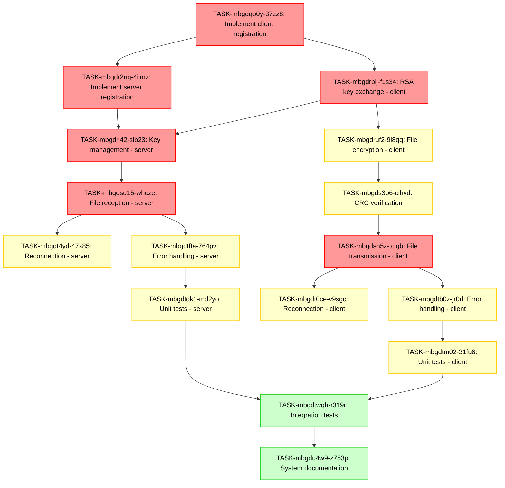

# Task Dependencies Diagram

## Legend
- **Red**: High Priority Tasks
- **Yellow**: Medium Priority Tasks
- **Green**: Low Priority Tasks

## Key Dependency Paths

1. **Client Registration → Server Registration → Key Management**
   - Critical path for establishing secure communication

2. **RSA Key Exchange → File Encryption → CRC → File Transmission**
   - Critical path for secure file transfer

3. **File Reception → Reconnection → Error Handling → Testing**
   - Critical path for system robustness

## Development Phases

1. **Phase 1**: Registration and Key Exchange (Tasks 1-4)
2. **Phase 2**: File Operations (Tasks 5-8)
3. **Phase 3**: Reliability Features (Tasks 9-12)
4. **Phase 4**: QA and Documentation (Tasks 13-16)

This diagram helps visualize the dependencies between tasks and can guide the development process by highlighting which tasks need to be completed before others can begin.
